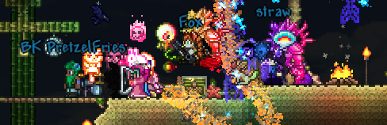

# [terraria-worlds.varrix.io]

terraria & friends!

## [downloads]
Click one of the following download links to get the corresponding `wld.bak`.

- [latest]
- [v2020-05-28], at `00:59:28` ([download](https://github.com/varrix/terraria-worlds.varrix.io/releases/download/v2020-05-28/expertclass-2020_05_28_00.59.28.wld.bak))

## quickstart

1. Download the file you want to play on Terraria from the [worlds](worlds/) folder.
2. Place it in your `../Terraria/Worlds` folder.
3. Remove the `.bak` extension to make it recognizable by Terraria as valid world file.
4. Possibly rename the file if you wish to have a different world name.
5. Start client/server hosting the world.
6. ???
7. Profit!

## contributors
- angie
- autumn
- coulten 
- jose (aka bk pretzel fries, aka only@bk, aka manwithacastleonacliff josie)
- martin
- muffin
- scourge
- tommy
- varrix

## license
Please see [MIT License](LICENSE) for more information.

[terraria-worlds.varrix.io]: http://terraria-worlds.varrix.io/
[downloads]: https://github.com/varrix/terraria-worlds.varrix.io/releases
[latest]: https://github.com/varrix/terraria-worlds.varrix.io/releases/latest
[v2020-05-28]: https://github.com/varrix/terraria-worlds.varrix.io/releases/tag/v2020-05-28
